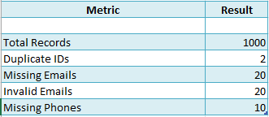
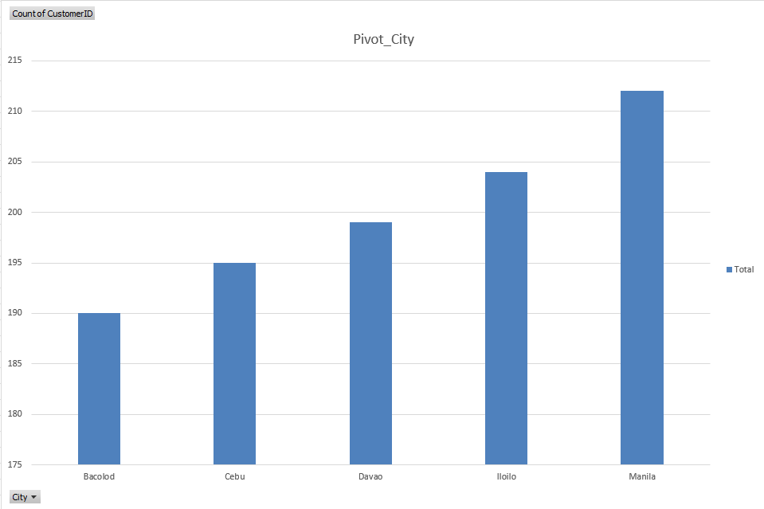
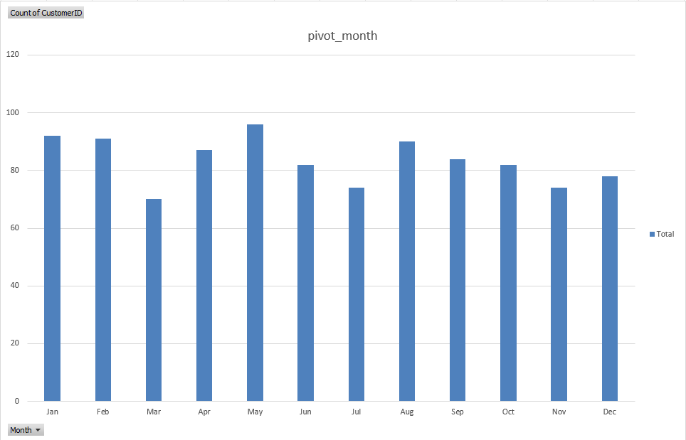
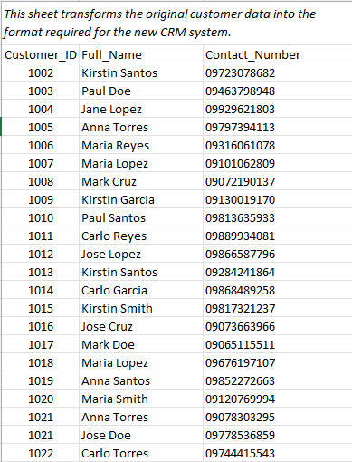

# customer-data-quality-analysis

# Customer Data Quality & Migration Analysis

## Project Overview

This project demonstrates Excel-based data analysis and data preparation for CRM migration.

A dataset containing 1,000 customer records was analyzed to identify data quality issues, validate information, and prepare migration-ready outputs.

---

## Objectives

- Analyze customer records
- Detect duplicate records
- Identify missing and invalid data
- Build Pivot Table reports
- Create a dashboard
- Prepare migration-ready data

---

## Tools Used

- Microsoft Excel
- Pivot Tables
- Excel Formulas
- Data Validation
- Data Mapping

---

## Skills Demonstrated

- Data Cleaning
- Data Validation
- Data Analysis
- Excel Reporting
- Pivot Tables
- Dashboard Creation
- Data Migration
- Documentation

---

## Project Workflow

1. Import customer data
2. Analyze data quality
3. Detect duplicates
4. Validate email and phone data
5. Create Pivot Tables
6. Build dashboard
7. Prepare migration output

---

## Dashboard

![Dashboard]documentation/dashboard.png)

---

## Data Quality Report

---

## Pivot Table - Customers by City

---

## Pivot Table - Registrations by Month

---

## Migration Output

---

## Results

- Analyzed 1,000 customer records
- Identified duplicate records
- Detected missing emails and phone numbers
- Validated email formats
- Built Pivot Table reports
- Prepared migration-ready customer data

---

## Author

Kirstin Britany
